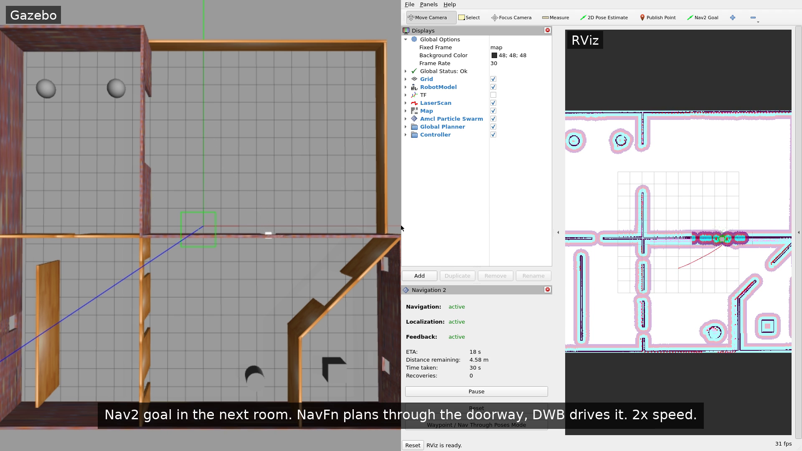

# testbed_navigation

Nav2 for the Testbed-T1.0.0, set up plugin by plugin instead of through `nav2_bringup`.

Demo video: [`media/demo.mp4`](media/demo.mp4) (1 minute). Gazebo on the left, RViz on the right: the
map loading, AMCL recovering from a wrong pose, and a goal in the next room.



## Run

```bash
# simulation
ros2 launch testbed_bringup testbed_full_bringup.launch.py

# each stage on its own
ros2 launch testbed_navigation map_loader.launch.py
ros2 launch testbed_navigation localization.launch.py   # includes map_loader
ros2 launch testbed_navigation navigation.launch.py
```

Or everything, with RViz:

```bash
ros2 launch testbed_navigation bringup.launch.py
```

AMCL starts at the spawn pose, so you can send a Nav2 Goal from RViz right away. The panel's
waypoint mode needs `nav2_waypoint_follower`, which isn't launched here.

## Layout

```
launch/   map_loader, localization, navigation, bringup
config/   map_server_params.yaml, amcl_params.yaml, nav2_params.yaml
rviz/     navigation.rviz
media/    screenshots
test/     static and runtime tests
```

## Approach

Each stage has its own lifecycle manager, so it can run without the others. `localization` includes
`map_loader` instead of starting a second map server.

| | plugin |
|---|---|
| planner | NavFn |
| controller | DWB |
| costmaps | static, obstacle, inflation |
| behaviors | spin, backup, drive_on_heading, wait |
| BT | stock Humble plugin list, default navigate-to-pose tree |
| extra | velocity smoother between the controller and the base |

Every plugin is declared by name in `nav2_params.yaml`, and the BT plugin list is written out as in
nav2's own Humble params. AMCL's frames, scan topic and laser range are set to match this robot and its
lidar. Beyond that I only set values that differ from nav2's defaults, and checked by dumping the
parameters each node actually runs with. The ones that matter for this robot:

- `robot_base_frame: base_footprint` for the costmaps, BT navigator and behavior server, which
  default to `base_link`.
- `robot_radius: 0.25`, from the 0.35 m square chassis. This only holds after the `base_footprint`
  fix (bug 6 in `../BUGS.md`).
- DWB velocity and acceleration limits. They default to zero. The velocity smoother uses the same
  limits.
- Obstacle layer `topic: /scan`, absolute. The costmap nodes are namespaced, so plain `scan` becomes
  `/local_costmap/scan` and the layer sees nothing, with no error.
- `max_obstacle_height: 2.0`. The default is 0, which throws away every return from a lidar mounted
  0.23 m up. Obstacle and raytrace ranges are raised to 10 and 11 m to use the 12 m lidar.
- AMCL initial pose at the spawn point, (0, 5).

There are no startup delays. The costmaps wait for `odom -> base_footprint` until the robot spawns,
so navigation is ready shortly after the robot appears.

## Challenges

- The URDF doesn't tell you where the parts are. Every mesh is exported in one CAD frame and each
  visual origin cancels it out, so I had to combine mesh bounds, visual origins and joint origins to
  get real positions. That's how I found bugs 5 to 7. The code is in `test/static/geometry.py`.
- Some things that looked broken weren't, and I only found out by running them: the `world` argument
  and the missing `use_sim_time`. The wheel separation bug also wasn't where I expected. Odometry was
  fine; the commanded turn rate was off.
- Running the stages together from one launch file left `controller_server` without its params file,
  and it failed with `No critics defined for FollowPath`. On its own it worked. `bringup` now passes
  each stage its params file explicitly.
- Odometry in this sim is exact, so comparing AMCL against ground truth always passes. The
  localization test knocks AMCL 0.5 m off instead, and checks it gets back within 0.15 m.
- The container had no GPU access, so Gazebo and RViz ran on software rendering. RViz logs one Mesa
  shader warning (`indexed_8bit_image`); the map still draws.
- Other ROS 2 nodes on my network showed up in the container, so I set `ROS_DOMAIN_ID` in my shell
  to keep them out.

## Screenshots

Stills from the demo video, Gazebo left and RViz right:

- `01_wrong_pose.png`: AMCL given a pose 0.7 m off. The particle cloud is away from the robot and the
  scan doesn't line up with the walls.
- `02_localized.png`: after one spin in place, back on the robot to within 0.1 m.
- `03_doorway.png`: goal at (0, -3) in the room below. The straight line hits a wall, so the path goes
  through the doorway.
- `04_goal_reached.png`: arrived, no recovery behaviors needed.

## Tests

```bash
colcon test --packages-select testbed_navigation
```

27 static tests, no simulator needed. They cover each starter bug and check the nav config against
the robot. Each one fails if its bug is put back.

The 4 runtime tests start Gazebo, so they're opt-in:

```bash
colcon build --packages-select testbed_navigation --cmake-args -DTESTBED_RUNTIME_TESTS=ON
colcon test --packages-select testbed_navigation
```

- goal in open space
- goal in the next room, through a doorway
- AMCL recovering from a 0.5 m error
- a box spawned next to the robot shows up in the local costmap

The last one is the only test that catches a blind obstacle layer, from a relative scan topic or
`max_obstacle_height: 0`. Navigation still succeeds off the static map either way.

All of them pass under both CycloneDDS and Fast DDS. I ran the runtime tests three times with each.
